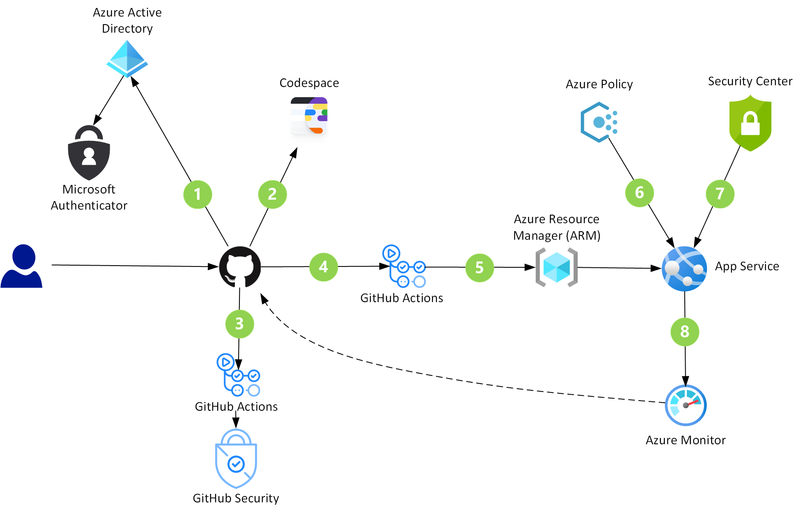

# DevSecOps in GitHub

DevSecOps involves utilizing security best practices from the beginning of development, shifting the focus on security away from auditing at the end and towards development in the beginning using a shift-left strategy. GitHub has tools that support every part of a DevSecOps workflow, and is a superb service for building cloud solutions.

*Download an [SVG](../media/devsecops-in-github.svg) of this architecture.*

## Data flow

1. Developers accessing GitHub resources are redirected to Azure AD for authentication using the SAML protocol. The organization enforces Single Sign-On (SSO) using FIDO2 strong authentication with the Microsoft Authenticator app
1. Developers access a Codespace (a prebuilt development environment) to begin working on tasks. The Codespace is a container that contains their IDE, correctly configured, pre-installed with required security scanning extensions
1. When new code is committed, GitHub Actions can initiate further code scanning to quickly and automatically find vulnerabilities and coding errors
1. A Pull Request triggers the code build and begins automated testing using GitHub Actions. Secrets and credentials are encrypted at rest and obfuscated in log entries
1. GitHub Actions deploys the build artifacts to App Service, while making changes to other cloud resources like service endpoints  
1. Azure Policy evaluates the Azure resources in the deployment and potentially denies the release, modifies the cloud resources, or creates warning events in the activity log
1. Azure Security Center identifies attacks targeting applications running in this project's deployments 
1. Continuous monitoring with Azure Monitor can revert (rollback) a commit based on monitoring data

## Components

* [Azure Active Directory](/azure/active-directory/fundamentals/active-directory-whatis) is a multi-tenant, cloud-based identity and access management service, controlling access to Azure and other cloud apps like M365 and GitHub
* [GitHub](https://docs.github.com/en/github) is where developers can collaborate with open source communities and within your organization (innersource)
* [Codespaces](https://docs.github.com/en/github/developing-online-with-codespaces/about-codespaces) is an online development environment, hosted by GitHub and powered by Visual Studio Code, that allows you to develop entirely in the cloud
* GitHub Security
  * [Vulnerability management](https://docs.github.com/en/github/managing-security-vulnerabilities) - when known vulnerabilities occur in your code (or in software packages your code uses), GitHub can raise an alert to the project, create a new branch with updated code, and trigger a pull request to fix the vulnerability
  * [GitHub Dependabot](https://docs.github.com/en/github/administering-a-repository/about-github-dependabot) is an automated agent that checks for outdated packages and applications. Dependabot can update software dependencies or vulnerabilities to newer versions
  * Code scanning - will inspect code for known vulnerabilities and coding errors at scheduled times or after certain events occur (like a commit or a push)
* [GitHub Actions](https://docs.github.com/en/actions/getting-started-with-github-actions/about-github-actions) are custom workflows that provide continuous integration (CI) and continuous deployment (CD) capabilities directly in your code repository  
* [Azure Policy](/azure/governance/policy/overview) helps you manage and prevent IT issues with policy definitions that can enforce rules for your cloud resources
* [Azure Security Center](/azure/security-center/security-center-intro) provides unified security management and advanced threat protection across hybrid cloud workloads
* [Azure Monitor](/azure/azure-monitor/overview) collects and analyzes app telemetry (performance metrics, activity logs, etc.), and can identify conditions that require an alert to be sent to a human or another app

## Vulnerability Management

GitHub security will attempt to identify and update any vulnerable dependencies in a repository. It will check whenever the following events occur:
* A new vulnerability is entered into the [GitHub Advisory Database](https://docs.github.com/en/github/managing-security-vulnerabilities/browsing-security-vulnerabilities-in-the-github-advisory-database)
* A new vulnerability notification appears from the third-party service, [WhiteSource](https://resources.whitesourcesoftware.com/blog-whitesource/github-security-updates)
* A repository's dependencies change

A *vulnerability*, when identified, causes the following data flow:

*Download an [SVG](../media/devsecops-in-github-vulnerability-management.svg) of this diagram.*

1. An email alert is sent to the organization owners and repository admins
1. GitHub [Dependabot](), a DevOps bot agent, will perform the following three (3) tasks automatically:
1. Create a new branch in the repository
1. Upgrade the necessary dependencies to the minimum possible secure version needed to avoid the vulnerability
1. Create a Pull Request (PR) with the upgraded dependency
1. When the PR is approved, the new branch is merged with the base branch
1. The merged branch triggers a GitHub Action to to perform its CI/CD tasks
1. The CI/CD tasks are performed and the new app version is deployed to a Test or Staging environment  

## Code Rollback

